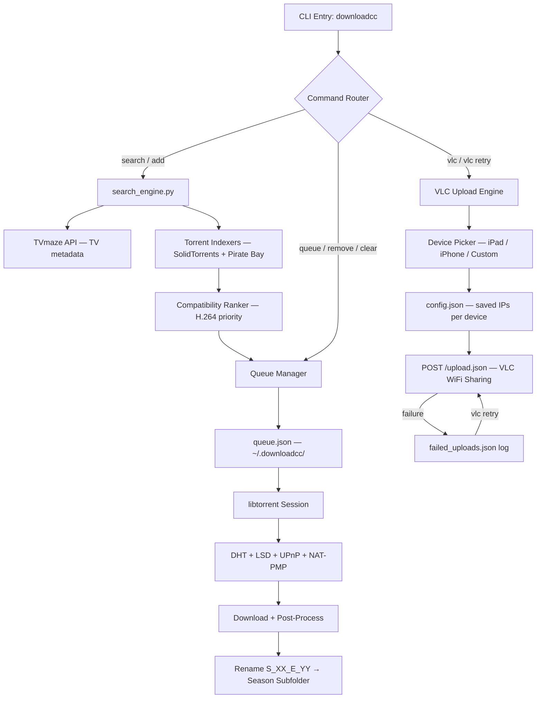

# 📺 downloadcc (v3.5)

[](https://www.python.org/)
[](https://libtorrent.org/)
[](https://www.microsoft.com/)
[](https://pyinstaller.org/)
[](https://opensource.org/licenses/MIT)

A fully interactive terminal-based media downloader. Search movies and TV shows, select seasons and episodes from a numbered menu, download via the native `libtorrent` engine, then wirelessly push files to **VLC on your iPad or iPhone** — all from the command line.

> **Personal Media Pipeline** — built to automate the full chain from torrent discovery → download → file organization → wireless device transfer, with zero manual steps.

---

## 📖 Table of Contents
- [Direct Download](#-direct-download)
- [Key Features](#-key-features)
- [System Architecture](#-system-architecture)
- [How to Install](#-how-to-install)
- [How to Use](#-how-to-use)
- [VLC Wireless Upload](#-vlc-wireless-upload)
- [Resuming & Self-Healing](#-resuming--self-healing)
- [Technical Stack](#-technical-stack)
- [Packaging & Distribution](#-packaging--distribution)
- [File Structure](#-file-structure)
- [License](#-license)

---

## 🚀 Direct Download

👉 **[Download MoviesAndShowsInstaller.exe](https://github.com/IamOumarIbrahim/movies-shows-downloader/raw/master/MoviesAndShowsInstaller.exe)**

*(Installs into AppData and automatically registers `downloadcc` in your User PATH — run from any shell immediately after install.)*

---

## ⭐ Key Features

- 💻 **100% Terminal-Based CLI**: Numbered interactive selection menus — no arrow keys or GUI required.
- 📺 **TV Show Metadata Integration**: Interfaces with the TVmaze API to dynamically load shows, seasons, and full episode lists.
- 🔍 **Strict Title Matching**: Custom regex validation ensures search results exactly match your target title, eliminating false positives.
- ⚡ **iPad/iPhone-Compatible Video Profiles**: Results rank H.264/`.mp4` streams highest and deprioritize HEVC/x265, AV1, and 10-bit formats for guaranteed out-of-the-box playback on iOS.
- 🚀 **High-Speed Peer Discovery**: DHT, Local Service Discovery (LSD), UPnP, and NAT-PMP all enabled for maximum torrent connectivity.
- 📁 **Automatic Post-Processing**: Organizes downloads into season subfolders and renames files to the clean `S_XX_E_YY.ext` convention automatically.
- 📱 **Multi-Device VLC Wireless Upload (v3.5)**:
  - Device picker lets you select **iPad**, **iPhone**, or a **Custom IP** each session.
  - Per-device IP is saved to your local config on first use — never re-type it again.
  - Real-time upload progress bars with MB/s display.
- 🔁 **Smart Retry for Failed Uploads (v3.5)**:
  - Failed uploads are automatically logged after every batch.
  - `downloadcc vlc retry` re-uploads **only** the failed files — no need to restart the whole batch.
  - Log is cleared automatically once all files succeed.
- 🔒 **IP Privacy (v3.5)**: No device IPs are hardcoded in source code. All addresses are stored in `~/.downloadcc/config.json` on your local machine only — never committed to version control.
- ⚙️ **Persistent Background Queue**: Download multiple shows/movies sequentially with live progress, automatic resume on restart, and self-healing torrent switching.

---

## 🏗️ System Architecture

The tool separates concerns into three distinct layers: search & metadata, torrent engine, and device transfer.

> [!NOTE]
> **Queue Concurrency**: Up to `MAX_PARALLEL_DOWNLOADS = 3` items can download simultaneously. A lock file (`~/.downloadcc/downloadcc.lock`) prevents duplicate background instances from corrupting the shared queue state.



---

## ⚙️ How to Install

### Method A: Setup Installer *(Recommended)*
1. Download and run **[MoviesAndShowsInstaller.exe](https://github.com/IamOumarIbrahim/movies-shows-downloader/raw/master/MoviesAndShowsInstaller.exe)**.
2. Complete the installer prompts — installs into `%AppData%\downloadcc` and registers `downloadcc` in User PATH.
3. Open a **new** PowerShell or Command Prompt window and run:
   ```bash
   downloadcc
   ```

### Method B: Manual Python Environment
1. Clone the repository:
   ```bash
   git clone https://github.com/IamOumarIbrahim/movies-shows-downloader.git
   cd movies-shows-downloader
   ```
2. Install dependencies:
   ```bash
   pip install requests beautifulsoup4 libtorrent pyinstaller
   ```
3. Run directly:
   ```bash
   python downloadcc.py
   ```

---

## 🏃 How to Use

### Command Reference

```
downloadcc                     Search and download interactively.
downloadcc "Query"             Search by name and select immediately.
downloadcc queue               View active download stats + full queue.
downloadcc add "Query"         Add a new item directly to the background queue.
downloadcc remove <number>     Remove a queued item by its index number.
downloadcc clear               Clear all pending items from the queue.
downloadcc vlc ["Target"]      Upload a folder/file wirelessly to VLC on iPad or iPhone.
downloadcc vlc retry           Re-upload only the files that failed in the last batch.
downloadcc help                Show this help menu.
```

### Searching & Downloading

```bash
downloadcc "Mr. Robot"
```

1. **Select a result** — type the number `[1]`, `[2]`, etc. and press **Enter** (or `c` to cancel). Results are pre-sorted by iPad/iPhone playback compatibility.
2. **Select a season** — for TV shows, pick a specific season or **All Seasons (Complete Pack)**.
3. **Live progress** — real-time percentage, speed (MB/s), peer count, and ETA are displayed in the terminal.

> [!NOTE]
> If the downloader is already running in the background, `downloadcc add "Query"` queues the item immediately without interrupting the current download.

---

## 📱 VLC Wireless Upload

Push downloaded files directly to **VLC for iOS** over WiFi — no cables, no iTunes.

### First-Time Device Setup

1. Open **VLC** on your iPad or iPhone.
2. Tap the **Network** tab → toggle **Sharing via WiFi** ON.
3. Note the IP address shown (e.g. `192.168.1.100`).
4. Run `downloadcc vlc` — select your device, enter the IP when prompted. It saves automatically.

> [!NOTE]
> Device IPs are stored in `~/.downloadcc/config.json` on your local machine only. They are **never** included in the source code or committed to version control.

### Device Picker Flow

```
--- VLC WiFi Sharing Uploader ---

Select Target Device (v3.5)
============================
  [1] iPad    [http://192.168.1.100]
  [2] iPhone  [not set]
  [3] Custom IP / hostname
  [c] Cancel / Go Back

Select an option (1-3 or c):
```

- **Saved IP** → confirmation prompt, press Enter to confirm or type a new IP to update it permanently.
- **[not set]** → first-time setup prompt, IP is saved after entry.
- **Custom** → one-time address, not saved to config.
- Use a **hostname** (e.g. `ipad.local`, `iphone.local`) instead of an IP if your device's address changes between sessions.

### Retrying Failed Uploads

If VLC disconnects mid-batch (screen lock, app backgrounded), run:

```bash
downloadcc vlc retry
```

Re-uploads **only** the failed files. If any still fail, the log updates and you can run retry again.

> [!TIP]
> Keep your device **screen on** and **VLC in the foreground** during large batch uploads for maximum reliability.

---

## ⚡ Resuming & Self-Healing

- **Auto-Resume**: If a download is interrupted, `downloadcc` automatically checks the staging folder, verifies existing torrent pieces, and continues exactly where it left off.
- **Self-Healing**: If a torrent fails to connect, exceeds a 60-second metadata timeout, or sustains zero download speed for over 60 seconds, the engine automatically tries the next candidate torrent or advances to the next queue item.

---

## 🛠️ Technical Stack

| Dependency | Purpose | Details |
| :--- | :--- | :--- |
| **Python** | Language Core | Version 3.12+ |
| **libtorrent** | Torrent Engine | Python bindings for rasterbar libtorrent |
| **Requests** | HTTP Client | VLC WiFi upload, torrent indexer requests |
| **BeautifulSoup4** | HTML Parser | Torrent search result scraping |
| **TVmaze API** | TV Metadata | Season/episode metadata extraction |
| **PyInstaller** | Packaging | Single-file `.exe` compilation |

---

## 📦 Packaging & Distribution

To recompile the CLI into a standalone executable and build the Windows installer:

```bash
# 1. Compile with PyInstaller
pyinstaller --noconfirm --onefile --console --name downloadcc downloadcc.py

# 2. Build Inno Setup installer
& "C:\Users\<user>\AppData\Local\Programs\Inno Setup 6\ISCC.exe" installer.iss
```

> [!NOTE]
> The `dist/` and `build/` directories are gitignored. Only the final `MoviesAndShowsInstaller.exe` is committed to the repository.

---

## 📁 File Structure

```
movies-shows-downloader/
├── .gitignore                   — Git ignore patterns (dist/, build/, __pycache__/)
├── README.md                    — Project documentation (this file)
├── MoviesAndShowsInstaller.exe  — Compiled standalone Windows installer
├── downloadcc.py                — Main interactive CLI entry point
├── installer.iss                — Inno Setup compiler configuration
└── search_engine.py             — TVmaze API + torrent indexer crawling engine

~/.downloadcc/                   — Local runtime data (never committed)
├── config.json                  — Saved device IPs, preferences
├── queue.json                   — Download queue state
├── failed_uploads.json          — Failed VLC upload log (auto-cleared on success)
└── downloadcc.lock              — Background process lock file
```

---

## 📄 License
This repository is licensed under the [MIT License](LICENSE).
